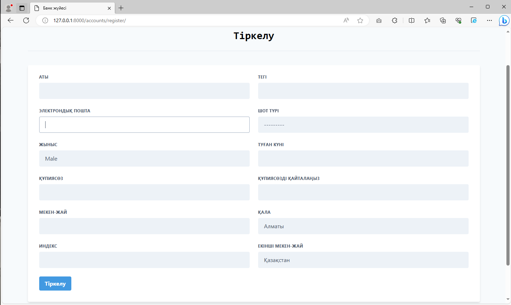

# Банк жүйесі
Бұл банк веб-қосымшасының басты парақшаларында тұтынушылар шоттарын басқарып, аударымдар жасай алады. Админ панелде әкімшілер барлық шоттарды және қолданушыларды басқара алады.
* Қолданылған тіл: <b>Python 3.7.5</b> 
* Веб-фреймворк: <b>Django</b>

## Скриншоттар





Жүйенің ақпараттық базасы <b>Faker</b> кітапханасын қолдана отырып кездейсоқ адамдардың ақпараттарымен толтырылған. Әр тұтынушыға шот деңгейі, соған байланысты ұсынылатын өнім тағайындалып, шығынға жататыны есептелген (churn - болашақта қолданбай кетуі мүмкіндігі). 


## Орнату
> GitHub-қа тіркеліп осы жобадағы <b>⭐Star</b> тетігін басыңыз (қалауыңызбен)

[Python](https://www.python.org/) веб-сайтынан Python бағдарламасын орнатыңыз (бұл жүйеге ең қолайлы - 3.7.5 версиясы).

Озіңізге ұнайтын Python бағдарламалау ортасын орнатыңыз, мысалға [Pycharm](https://www.jetbrains.com/ru-ru/pycharm/).

Жобаны жүктеп алып, архивтен шығарып оны кез келген ыңғайлы жерге орналастырыңыз. 

Сосын <b>Командная строка</b>-ны ашып мына командаларды енгізіңіз (жобаның орынын озіңіздін жобаны орналастырған жерімен ауыстырыңыз)

```
cd C:\Users\JZX100\Projects\banking-system_kz
python -m venv env
env\Scripts\activate
pip install -r requirements.txt
```
Веб-қосымшаны қосу үшін:
```
python manage.py runserver
```
Веб-қосымша қосылған соң жүйеге осы адрес бойынша кіресіз: http://127.0.0.1:8000/

* Қарапайым қолданушы логины: testuser@gmail.com
* Құпиясөз: Qqwerty1!

Админ панеліне кіру үшін http://127.0.0.1:8000/admin:

* Логины: admin@gmail.com
* Құпиясөз: Qqwerty1!

Бұл жүйе [осы жоба](https://www.sourcecodester.com/python-django-simple-banking-management-system-source-code) негізінде жасалған.

## Байланыс
* Егер сізде осы жоба жайлы сұрақтар туындаса <b>Issues</b> парақшасында сұраныс қалдырсаңыз болады. 
* Менімен осы сілтеме бойынша Telegram желісінде байланысуға болады - [@JZX_I00](https://t.me/JZX_I00). 


